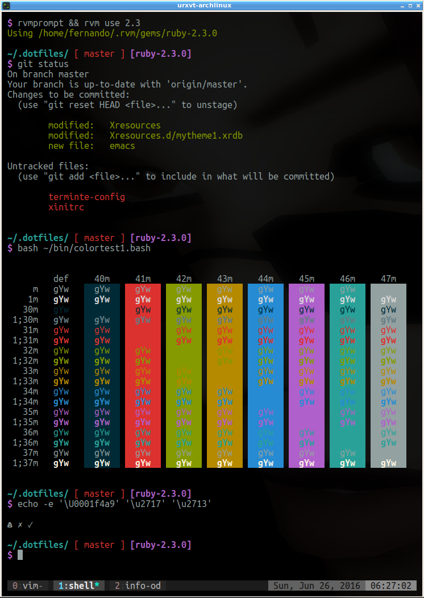
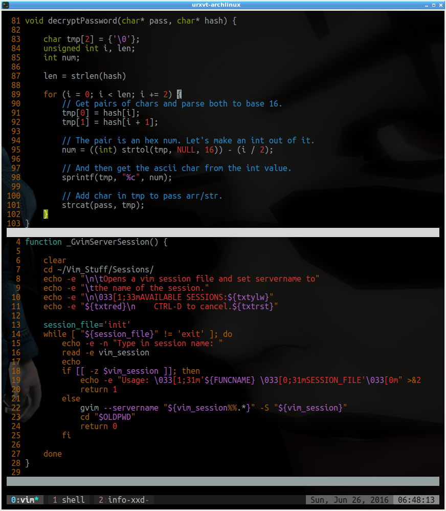
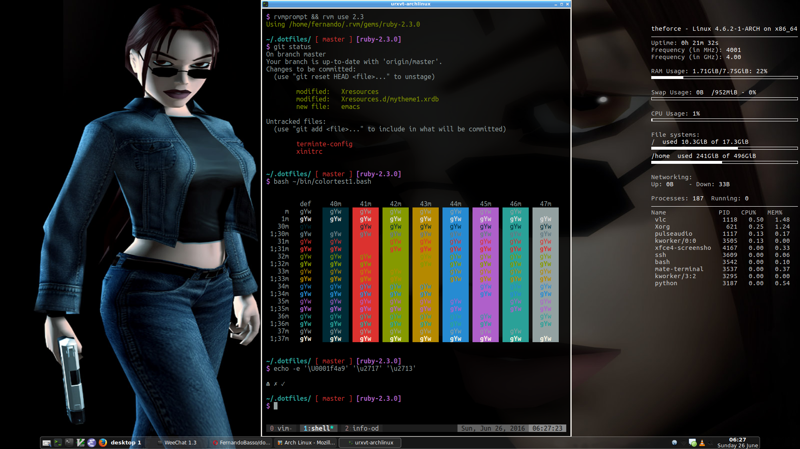
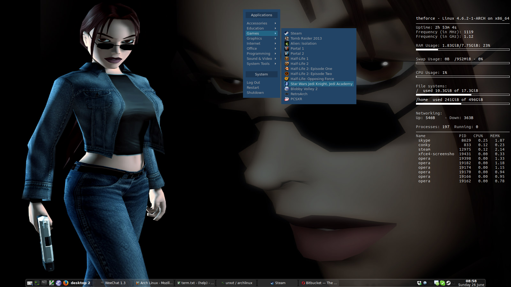

= My Dotfiles

== Intro
Nothing much to say... Config files for some of the programs and tools I use. There is much more to add but I have to organize things better first.

== Screenshots

My Arch Linux setup with openbox, tint2, conky, urxvt, vim, etc.

'''

.urxvt terminal, commands, git, color test, utf-8

'''

.urxvt vim editing shell script and C file

'''

.urxvt command line demo on openbox, tint2 and conky.

'''

.My (simple) desktop, tint2, conky

'''

Question: What does (y) look like to you?

That is it for now. May the force (and the source) be always with you. ☺ ✓

